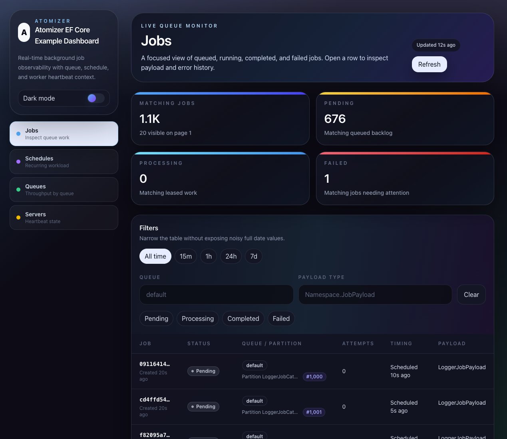

# Atomizer

> **Break down complexity. Scale with confidence.**
> Atomizer transforms large-scale job processing into atomic, reliable, and easily managed units—making distributed systems simple, robust, and a joy to work with.

## Overview
Atomizer is a modern, high-performance job scheduling and queueing framework for ASP.NET Core. Built for cloud-native, distributed applications as well as smaller setups and local development, Atomizer provides a powerful yet easy-to-use solution for processing background jobs, handling complex workflows, and scaling your applications effortlessly.

- **Effortless distributed scaling:** Atomizer works seamlessly in clustered setups, letting you process jobs across multiple servers for true horizontal scalability.
- **Flexible architecture:** Plug in your preferred storage backend, configure multiple queues, and extend with custom drivers or handlers.
- **Reliable and robust:** Enjoy graceful shutdowns, automatic retries, and job visibility timeouts to ensure jobs are never lost or duplicated.
- **Developer-friendly:** Atomizer integrates with ASP.NET Core DI, logging, and modern C# features, so you can focus on your business logic.

## Features
- ⏰ **Recurring Scheduled Jobs** — Cron-like recurring execution for time-based workflows.
- 🚀 **Distributed Processing** — Scale out to as many servers as your storage backend supports; Atomizer coordinates job execution across the cluster.
- 🗄️ **Multiple Storage Backends** — Use Entity Framework Core for durable, database-backed queues; in-memory for fast local development & testing; Redis support coming soon.
- 🔀 **Multiple Queues** — Configure independent queues with custom processing options for each workload.
- 🧩 **Extensible Drivers & Handlers** — Easily add new storage drivers or job handlers; auto-register handlers from assemblies.
- ♻️ **Advanced Retry Policies** — Automatic, configurable retries to keep your jobs running smoothly—even when things go wrong.
- 🛑 **Graceful Shutdown** — Ensure in-flight jobs finish and pending batched jobs are safely released for re-processing during shutdowns.
- 📦 **Batch Processing** — Tune throughput with batch size and parallelism settings per queue.
- ⏳ **Visibility Timeout** — Prevent job duplication by locking jobs during processing.
- 🕒 **FIFO Partitioned Processing** — Guarantee strict in-order, one-at-a-time execution per partition key (e.g. per customer, per entity).
- 🧪 **In-Memory Driver** — Perfect for local development and testing; spin up queues instantly with zero setup.
- 📈 **Dashboard** — Optional read-only dashboard for jobs, schedules, queue statistics, and worker heartbeats.
- 🔔 **ASP.NET Core Integration** — Works with DI, logging, and modern C# idioms.

## Planned Features
- ⚡ **Redis Driver** — Lightning-fast, distributed, in-memory queues for massive scale.

## Quick Start
Get up and running in minutes:

### 1. Install the package
```bash
dotnet add package Atomizer
dotnet add package Atomizer.EntityFrameworkCore

# Optional: add the monitoring dashboard
dotnet add package Atomizer.Dashboard
```

### 2. Configure Atomizer
Set up Atomizer in your ASP.NET Core project:
```csharp
builder.Services.AddAtomizer(options =>
{
    // Configure the default queue 
    // (optional, a default queue is created automatically with configuration like below)
    options.AddQueue(QueueKey.Default, queue => 
    {
        queue.DegreeOfParallelism = 4; // Max 4 jobs processed concurrently
        queue.BatchSize = 10; // Retrieve 10 jobs at a time
        queue.VisibilityTimeout = TimeSpan.FromMinutes(5); // Prevent job duplication by "hiding" jobs for 5 minutes while processing
        queue.StorageCheckInterval = TimeSpan.FromSeconds(15); // Poll for new jobs every 15 seconds
    });
    
    // Add more queues as needed
    options.AddQueue("product", queue => 
    {
        queue.DegreeOfParallelism = 2;
        queue.BatchSize = 5;
    });
    
    // Register job handlers automatically
    options.AddHandlersFrom<AssignStockJobHandler>();
    
    // Use EF Core-backed job storage
    options.UseEntityFrameworkCoreStorage<ExampleDbContext>();
});

// Add Atomizer processing services
builder.Services.AddAtomizerProcessing(options =>
{
    options.StartupDelay = TimeSpan.FromSeconds(5); // Delay startup to allow other services to initialize
    options.GracefulShutdownTimeout = TimeSpan.FromSeconds(30); // Allow up to 30 seconds for jobs to finish on shutdown
});

// Optional: add the Atomizer Dashboard services
builder.Services.AddAtomizerDashboard(options =>
{
    options.Title = "Atomizer Dashboard";
    options.StatsRefreshInterval = TimeSpan.FromSeconds(5);
    options.JobsRefreshInterval = TimeSpan.FromSeconds(30);
});
```

Inside your `DbContext`:
```csharp
protected override void OnModelCreating(ModelBuilder modelBuilder)
{
    modelBuilder.AddAtomizerEntities(schema: "atomizer");
    // ...other model config...
}
```
Make sure to run migrations to create the necessary tables.

Note:
>If using MySql, set schema to 'null' or configure schema behavior in your `DbContext` as MySql is not compatible with EF Core schemas.

### 3. Define a Job Handler
Create a handler for your job payload:
```csharp
public record SendNewsletterCommand(Product Product);

public class SendNewsletterJob(INewsletterService newsletterService, IEmailService emailService)
    : IAtomizerJob<SendNewsletterCommand>
{
    public async Task HandleAsync(SendNewsletterCommand payload, JobContext context)
    {
        var subscribers = await newsletterService.GetSubscribersAsync(payload.Product.CategoryId);
        var emails = new List<Email>();
        
        foreach (var subscriber in subscribers)
        {
            emails.Add(new Email { /* ... */ });
        }
        
        await Task.WhenAll(emails.ConvertAll(email => emailService.SendEmailAsync(email)));
    }
}
```

### 4. Enqueue or schedule a Job
Add jobs to the queue from your application code:
```csharp
app.MapPost(
    "/products",
    async ([FromServices] IAtomizerClient atomizerClient, [FromServices] ExampleDbContext dbContext) =>
    {
        var product = new Product { /* ... */, CategoryId = Guid.NewGuid() };
        dbContext.Products.Add(product);
        await dbContext.SaveChangesAsync();
        
        await atomizerClient.EnqueueAsync(new SendNewsletterCommand(product));

        return Results.Created($"/products/{product.Id}", product);
    }
);
```

### 5. FIFO Processing (Partitioned Jobs)
To guarantee jobs for the same entity execute one-at-a-time in enqueue order, assign a `PartitionKey`:

```csharp
// All stock events for the same product are processed in strict FIFO order.
await atomizerClient.EnqueueAsync(
    new StockEvent(productId, "restock", delta: 50),
    options => options.PartitionKey = new PartitionKey(productId.ToString())
);
```

Jobs sharing the same `PartitionKey` and queue are serialized: the next job in the partition only starts after the previous one completes (or fails and is rescheduled). Unpartitioned jobs in the same queue are unaffected and continue to process in parallel.

### 6. Schedule Recurring Jobs
in Program.cs:
```csharp
...
var app = builder.Build();

var atomizer = app.Services.GetRequiredService<IAtomizerClient>();

await atomizer.ScheduleRecurringAsync(
    new LoggerJobPayload("Recurring job started", LogLevel.Information),
    "LoggerJob",
    Schedule.Every(2).Minutes()
);

...
```

### 7. Dashboard (Optional)
If you install `Atomizer.Dashboard`, map the embedded dashboard SPA after building your app:

```csharp
var app = builder.Build();

app.MapAtomizerDashboard("/atomizer");
```

Then browse to `/atomizer` to inspect jobs, job details, schedules, queue statistics, and active worker heartbeats. The dashboard is read-only in the current release; it does not retry, cancel, or dead-letter jobs.



If no authorization filters are configured, dashboard requests are restricted to localhost by default. Add an `IAtomizerDashboardAuthorizationFilter` through `AddAtomizerDashboard(options => options.Authorization.Add(...))` before exposing it outside local development.

For production, prefer integrating with ASP.NET Core authorization:

```csharp
builder.Services.AddAuthorization(options =>
{
    options.AddPolicy("AtomizerDashboard", policy =>
        policy.RequireAuthenticatedUser().RequireRole("Operations"));
});

builder.Services.AddAtomizerDashboard(options =>
{
    options.Authorization.RequirePolicy("AtomizerDashboard");
});
```

Make sure the host app runs its authentication middleware before mapping the dashboard:

```csharp
app.UseAuthentication();
app.UseAuthorization();
app.MapAtomizerDashboard("/atomizer");
```

The dashboard also provides shortcuts for common requirements:

```csharp
builder.Services.AddAtomizerDashboard(options =>
{
    options.Authorization.RequireAuthenticatedUser();
    // or: options.Authorization.RequireRoles("Operations", "Admin");
    // or: options.Authorization.RequireClaim("scope", "atomizer.dashboard.read");
});
```

Multiple dashboard authorization filters are evaluated as alternatives; the first filter that authorizes a request allows it.

Basic authentication is available as an explicit opt-in filter. It requires HTTPS by default:

```csharp
builder.Services.AddAtomizerDashboard(options =>
{
    options.Authorization.RequireBasicAuthentication(
        builder.Configuration["AtomizerDashboard:Username"]!,
        builder.Configuration["AtomizerDashboard:Password"]!);
});
```

For credentials stored outside configuration, use the async validator overload:

```csharp
builder.Services.AddAtomizerDashboard(options =>
{
    options.Authorization.RequireBasicAuthentication(async (context, username, password) =>
    {
        var validator = context.RequestServices.GetRequiredService<IDashboardCredentialValidator>();
        return await validator.ValidateAsync(username, password, context.RequestAborted);
    });
});
```

Custom authorization filters can also do asynchronous work:

```csharp
public sealed class DashboardAuthorizationFilter : IAtomizerDashboardAuthorizationFilter
{
    public async ValueTask<DashboardAuthorizationResult> AuthorizeAsync(HttpContext context)
    {
        var access = context.RequestServices.GetRequiredService<IDashboardAccessService>();
        return await access.CanReadDashboardAsync(context.User, context.RequestAborted)
            ? DashboardAuthorizationResult.Authorized
            : DashboardAuthorizationResult.Forbidden;
    }
}
```

Dashboard API calls are same-origin requests and include same-origin credentials, so cookie, Windows, and other host-level authentication schemes can flow naturally. If your setup needs the embedded frontend to attach an extra request header, configure it when serving the dashboard HTML:

```csharp
builder.Services.AddAtomizerDashboard(options =>
{
    options.Authorization.RequirePolicy("AtomizerDashboard");
    options.Client.RequestHeaders.Add("X-CSRF-TOKEN", context => context.Request.Cookies["X-CSRF-TOKEN"]);
});
```

Do not put long-lived shared secrets in `Client.RequestHeaders`; those values are rendered into the dashboard page and are visible to the browser. Use them for request metadata such as CSRF tokens or short-lived per-user tokens.

## Contributing
1. Fork the repository.
2. Create a new branch (feature/xyz).
3. Commit your changes with clear messages.
4. Submit a PR with details of your changes and test coverage.

## License
This project is licensed under the MIT License. See the [LICENSE](LICENSE) file for details
